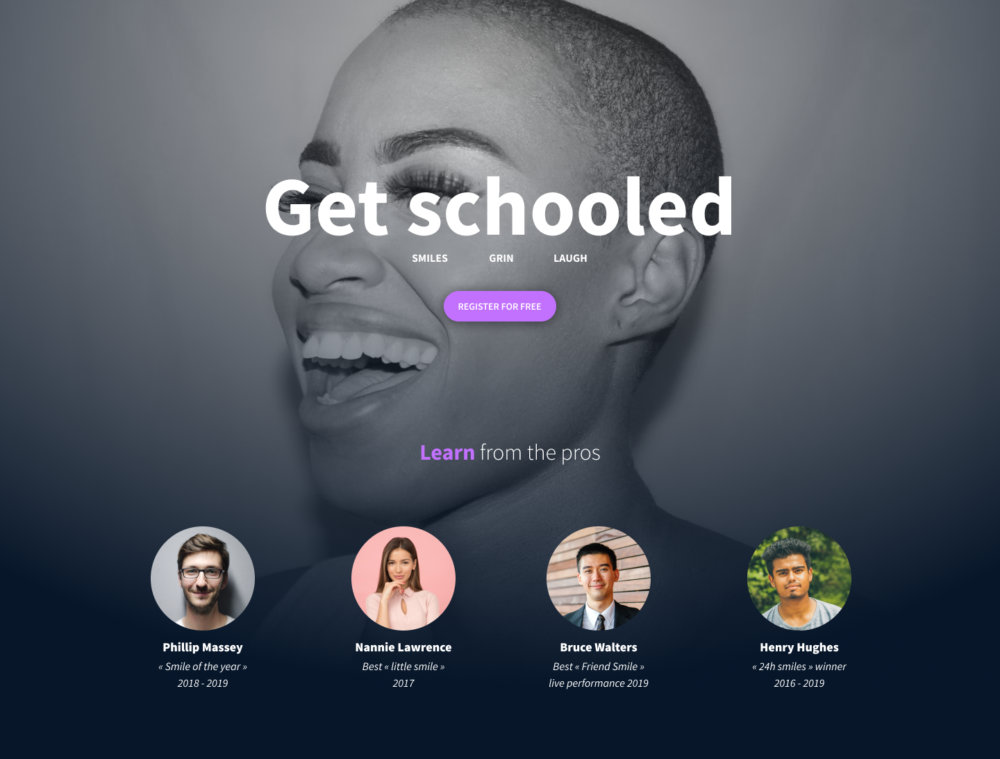

# SmileSchool

## Overview

SmileSchool is an interactive platform designed to help users learn the art of smiling. Whether you're mastering your grin, perfecting your laugh, or refining your signature smile, SmileSchool connects you with the pros to achieve your best expression.

## Features

- Tutorials from professional smiling champions.
- Free membership offering exclusive resources.
- Video tutorials covering different types of smiles: diagonal, sad, natural, and happy.

## Project Homepage

The homepage is carefully designed to provide users with:

1. A welcoming and motivational header: "Get Schooled."
2. Testimonials and credentials from smile experts.
3. Easy navigation to popular tutorials and membership details.

## How to Use

1. Clone or download the repository.
2. Open the homepage file (`index.html`) in your preferred browser.
3. Explore tutorials and enjoy the learning experience!

## Contribution

We welcome contributions to make SmileSchool even better. To contribute:

1. Fork this repository.
2. Create a new branch for your feature or fix.
3. Submit a pull request.

## Credits

Design inspiration and visuals provided by the SmileSchool team.

## License

This project is licensed under the MIT License. See the LICENSE file for details.
